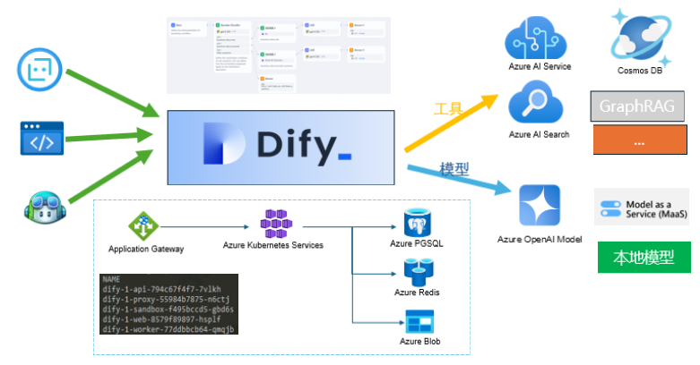
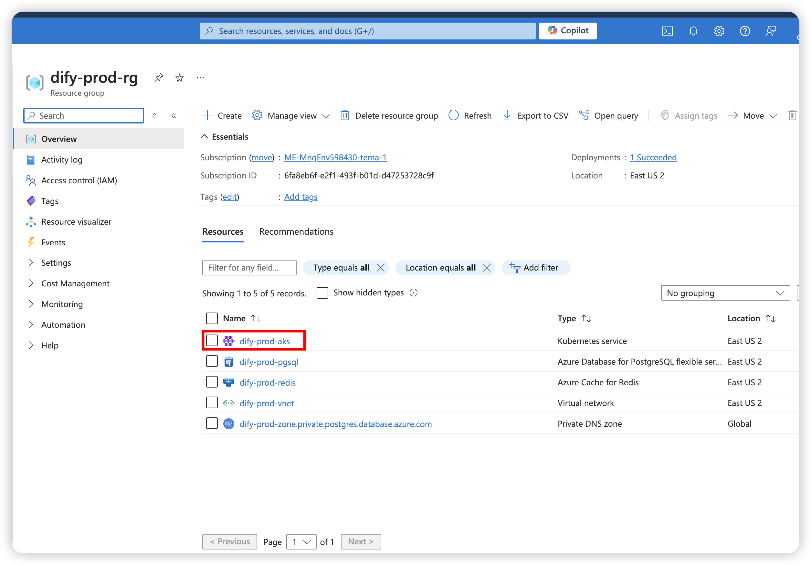
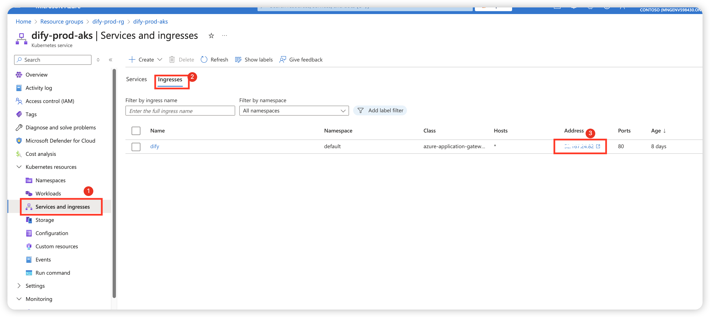
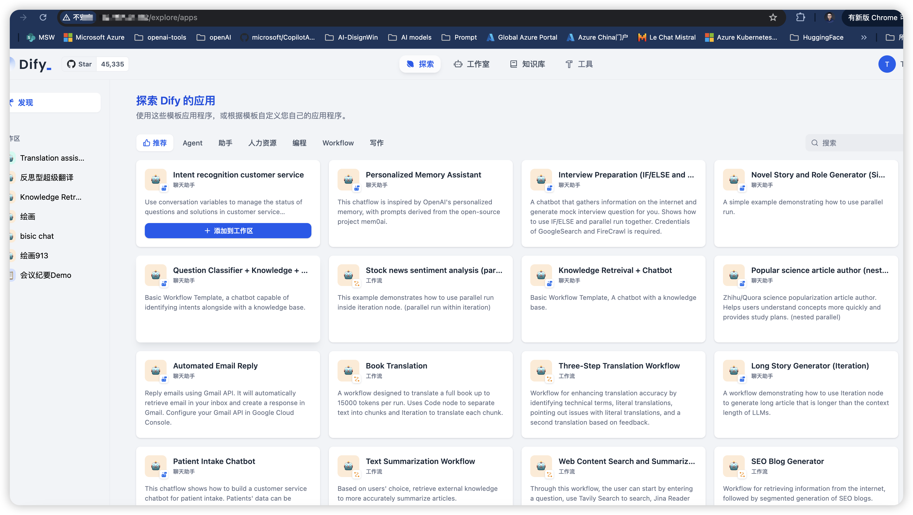

# Dify on Azure
## Overview
- 这是一个如何在 Azure 上部署 Dify 项目的简单示例。
- 部署之前也可以体验一下这个部署好的例子体验一下：http://dify-gpschina.eastus2.cloudapp.azure.com/ 登陆用户名/密码(无编辑权限)：dify2@gmail.com/dify1234
## Topology



# Dify on Azure部署指南

## 前提条件
- 操作系统管理员权限
- 已安装Terraform，若没有安装的话，请参考Windows上安装步骤Terraform进行安装。
- 已安装Azure CLI，若没有安装的话，请参考Windows上安装Azure CLI指南进行安装。

## Windows上安装步骤Terraform（如已安装可以略过该步骤）

### 1. 下载Terraform
- a. 打开浏览器，访问[Terraform下载页面](https://www.terraform.io/downloads.html)。
- b. 在页面中找到适用于Windows的版本，点击下载链接。

### 2. 解压文件
- a. 下载完成后，找到下载的ZIP文件（例如：`terraform_1.0.0_windows_amd64.zip`）。
- b. 右键点击ZIP文件，选择“解压到当前文件夹”或使用您喜欢的解压工具解压文件。

### 3. 将Terraform添加到系统路径
- a. 将解压后的`terraform.exe`文件移动到您希望存放的目录，例如：`C:\terraform`。
- b. 打开“控制面板”，选择“系统和安全”，然后选择“系统”。
- c. 点击左侧的“高级系统设置”。
- d. 在“系统属性”窗口中，点击“环境变量”按钮。
- e. 在“环境变量”窗口中，找到“系统变量”部分，选择`Path`变量，然后点击“编辑”。
- f. 在“编辑环境变量”窗口中，点击“新建”，然后输入`C:\terraform`（即`terraform.exe`所在的目录）。
- g. 点击“确定”保存更改。

### 4. 验证安装
- a. 打开命令提示符（按`Win + R`，输入`cmd`，然后按回车）。
- b. 在命令提示符中输入以下命令并按回车：
   ```sh
   terraform -v
   ```
- c. 如果安装成功，您将看到Terraform的版本信息输出。


## Windows上安装Azure CLI指南（如已安装可以略过该步骤）

### 1. 下载Azure CLI安装程序
- a. 打开浏览器，访问[Azure CLI下载页面](https://docs.microsoft.com/cli/azure/install-azure-cli-windows?tabs=azure-cli)。
- b. 在页面中找到适用于Windows的安装程序，点击下载链接。

### 2. 运行安装程序
- a. 下载完成后，找到下载的安装程序文件（例如：`AzureCLI.msi`）。
- b. 双击安装程序文件，启动安装向导。
- c. 按照安装向导的提示进行安装，接受许可协议并选择默认安装选项。

### 3. 验证安装
- a. 安装完成后，打开命令行工具。
- b. 输入以下命令以验证Azure CLI是否安装成功：
    ```sh
    az --version
    ```
- c. 如果安装成功，您将看到Azure CLI的版本信息。

### 4. 登录到Azure
- a. 在命令提示符或PowerShell中，输入以下命令以登录到您的Azure账户：
    ```sh
    az login
    ```
- b. 按照提示在浏览器中完成登录过程。


现在，您已经成功在Windows上安装了Azure CLI，并可以开始使用它来管理您的Azure资源。


## 在配置 Dify 之前，请检查并设置 dev-variables.tfvars 文件中的变量。

在 dev-variables.tfvars 文件中，定义了6个变量：

- sp-subscription-id Azure订阅ID
- sp-client-id：这是服务主体的客户端 ID。它是一个唯一标识符，用于标识特定的服务主体。
- sp-client-secret：这是服务主体的客户端密钥。它类似于密码，用于验证服务主体的身份。这个值应当保密，不应公开。
- sp-tenant-id：这是租户 ID。它标识了 Azure Active Directory (AAD) 中的特定租户，通常用于多租户环境中区分不同的组织或用户组。
- name：Dify平台的名字，用于创建或定义多个服务的名字（比如Azure资源组，Azure Private DNS zone等），需要全球唯一。
- filename ：指定您的本地电脑中存储AKS凭据文件kubeconfig的路径
### 1.  执行下列命令，创建服务主体（service principal），根据您的azure环境修改命令中的参数
```bash
az login
az ad sp create-for-rbac --name <your-service-principal-name> --role Owner --scopes /subscriptions/<your-subscription-id>


```

### 2.执行上述命令后，你将获得一个 JSON 响应，其中包含 appId（即 sp-client-id）、password（即 sp-client-secret）和 tenant（即 sp-tenant-id）。

示例输出：
```bash
{
  "appId": "xxxxxxxx-xxxx-xxxx-xxxx-xxxxxxxxxxxx",
  "displayName": "<your-service-principal-name>",
  "name": "http://<your-service-principal-name>",
  "password": "xxxxxxxx-xxxx-xxxx-xxxx-xxxxxxxxxxxx",
  "tenant": "xxxxxxxx-xxxx-xxxx-xxxx-xxxxxxxxxxxx"
}
```
### 3.将这些值填入你的 dev-variables.tfvars 文件中：（appId即sp-client-id，password即sp-client-secret，tenant即sp-tenant-id）
```bash
sp-client-id = "xxxxxxxx-xxxx-xxxx-xxxx-xxxxxxxxxxxx"
sp-client-secret = "xxxxxxxx-xxxx-xxxx-xxxx-xxxxxxxxxxxx"
sp-tenant-id = "xxxxxxxx-xxxx-xxxx-xxxx-xxxxxxxxxxxx"
```
- **注意：本repo默认在Windows下运行Terraform，如果运行Terraform使用Mac或Linux的话，需要在
DIFYONAZURE/modules/dify/main.tf文件中修改chat的路径格式如下：chart = "./helm-release/dify-helm/charts/dify"**

## 使用terraform将dify部署到Azure
- 通过运行“terraform init”初始化 **Terraform**。

```bash

terraform init

```
- 通过运行以下**terraform plan**为开发环境生成计划。
```bash

terraform plan -out=dev-plan -var-file="./environments/dev-variables.tfvars"

```
- 通过运行以下**terraform apply**命令应用生成的计划。
```bash

terraform apply "dev-plan"
```

## 部署后的配置
- 1.现在，您已经成功在Azure上部署了Dify，接下来登陆Azure门户，从刚刚创建的资源组中找到Azure Kubernetes Service集群，并打开它。

- 2.按图示找到您在azure上部署的Dify的公网地址。

- 3.点击ingress的IP 地址，将会在浏览器中显示Dify。第一次使用请设置账户信息

- 4.登陆后可以开始使用Dify了！

