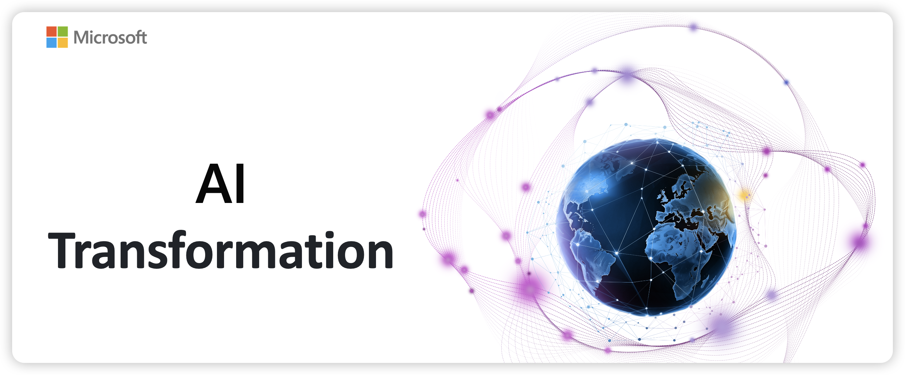

# AI Transformation 最佳实践

欢迎来到AI Transformation最佳实践的GitHub仓库！本仓库旨在分享和推广在AI项目中取得成功的最佳实践和经验教训。无论你是AI领域的新手还是经验丰富的专家，这里都有你需要的资源和指导。

## 目标

我们的目标是通过分享实际案例、技术文档和工具，帮助开发者和企业在AI项目中取得成功。我们将涵盖从项目规划、数据准备、模型训练到部署和优化的各个方面。

## 内容

- **案例研究**：详细介绍成功的AI项目，包括项目背景、挑战、解决方案和结果。
- **AI技术实践**：提供关于AI模型开发、训练和部署的详细指南和教程。
  - Dify：Dify是一个开源的LLM（大型语言模型）应用开发平台，提供从Agent构建到AI工作流编排、RAG检索、模型管理等多种功能，帮助开发者轻松构建生成式AI应用。
  - Coze ：Coze 是一个新一代的 AI 应用和聊天机器人开发平台。无论你是否有编程经验，Coze 都能帮助你轻松创建各种聊天机器人，并将它们部署在不同的社交平台和消息应用上。
- **工具和资源**：分享有用的工具、库和数据集，帮助你加速AI项目的开发。

## 贡献

我们欢迎社区的贡献！如果你有成功的AI项目经验或有用的资源，欢迎提交Pull Request，与大家分享你的智慧。
